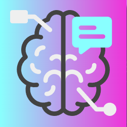

    
    <h3 align="center">smart-brain</h3>
    Frontend repo for viewing detected faces using Clarifai's AI models API.
     

## Details

https://user-images.githubusercontent.com/30333942/147852975-57df2f75-2e4b-497e-8200-447df9209df4.mp4

The frontend repo of a full stack web application that enables logged-in users to upload images to view detected faces using a face recognition AI model using Clarifai's REST API.

Backend: [https://github.com/rzmk/smart-brain-api](https://github.com/rzmk/smart-brain-api)

## Features

- Login and registration system.
- Upload image URLs to view detected faces.
- Stores user login information in a database and total number of image URLs uploaded by each user.

## Stack

### Frontend

- [React](https://reactjs.org/) (frontend)
- [Tachyons](https://tachyons.io/) (CSS toolkit)

### Backend

- [Node.js](https://nodejs.org/) (server)
- [Express](https://expressjs.com/) (web app framework for Node.js)
- [PostgreSQL](https://www.postgresql.org/) (database)
- [Clarifai](https://www.clarifai.com/) (face recognition AI model API)

### Hosting

- [Heroku](https://www.heroku.com/) (hosting)

## Acknowledgements

- [Zero to Mastery Academy](https://academy.zerotomastery.io/p/complete-web-developer-zero-to-mastery)
